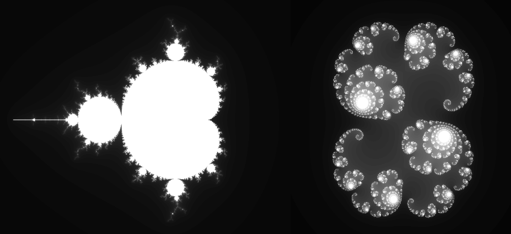
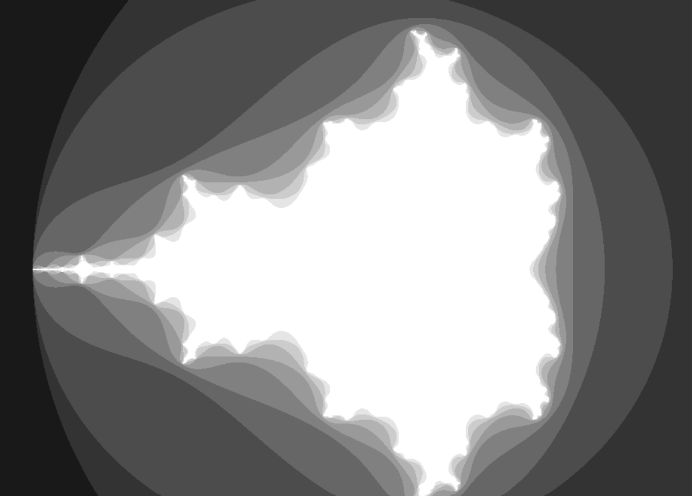

<h1><table border="0px"><tr><td valign="center"></td><td valign="center">Multibrot & Julia Sets Visualization</td></tr></table></h1>

This project is a visualizer for the Multibrot and Julia Sets.

Try the web [demo](https://xhst.github.io/multibrot-set/).
## 🔎 About
### ✤ Multibrot Set

The **Multibrot Set** $\mathcal{M}$ is the set of values in the complex plane whose absolute value remains below some finite value throughout iterations.

$$f_c : \mathbb{C} \longrightarrow \mathbb{C}$$

in the form:

$$f_c(z) = z^p + c$$

For each complex parameter $c$ we consider the behavior of the succession $(0, f_c(0), f_c(f_c(0)), \dots )$ obtained by iterating $f_c(z)$ from the point $z = 0$ this can either diverge to infinity or be limited.
The Multibrot set is defined as the set of points $c$ such that the corresponding subsequence is limited. 
The previous succession can also be written as:

$$\begin{cases}z_0 = 0 \\
z_{n+1} = z^p + c\end{cases}$$

if we indicate with $f^n_c(z)$ the $n$-th iteration of $f_c(z)$, $(f_c \circ f_c \circ \dots \circ f_c)(z)$ self composed $n$ times, the Multibrot Set is:

$$\mathcal{M} =  \\\{\ c \in \mathbb{C} : \sup_{n \in \mathbb{N}}\ |f^n_c(z)| < \infty \\}\ $$

The case of $p = 2$ is the classic Mandelbrot set from which the name is derived. 

### ✷ Julia Set

## 🟢 Getting started
### ✔️ Prerequisites
You need to have Node.js and npm installed on your machine. You can download Node.js [here](https://nodejs.org/en/download/) and npm is included in the installation.
### 🛠 Installation
First, clone the repository to your local machine:
```
git clone https://github.com/xhst/multibrot-set.git
```
then, navigate to the project directory and install the dependencies with:
```
npm install
```
### ▶️ Build
To build the application, run:
```
npm run build
```

## 🖼️ Screenshots
#### Mandelbrot and Julia sets, point $(0.2815, -0.0085i)$, with grayscale coloring


#### Mandelbrot and Julia sets, point $(-0.245, -0.655i)$, with linear coloring


#### Mandelbrot and Julia sets, point $(-0.8, -0.155i)$, with normalized iteration count (6 bail-out radius) coloring


#### 10 iterations Mandelbrot


#### 100 iterations Mandelbrot


#### 1000 iterations Mandelbrot

